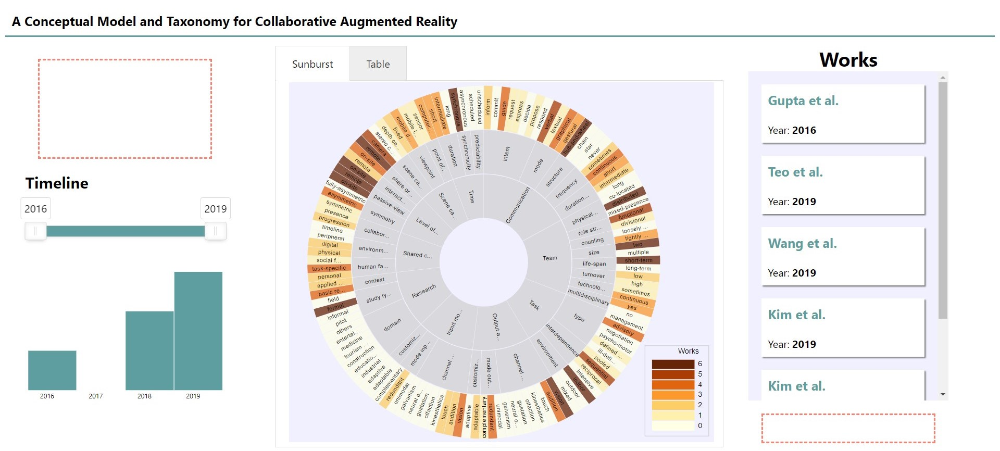

# Survey Viewer

This Viewer presents a sunburst heatmap as an overview visualization of a literature survey.  
It supports filter by year, selection of individual items by cards and two main visualizations.  
The sunburst has a drill down interaction, allowing better visualization of leaf nodes.  

First look on [overview page](https://tiagodavi70.github.io/survey_viewer/overview.html).
